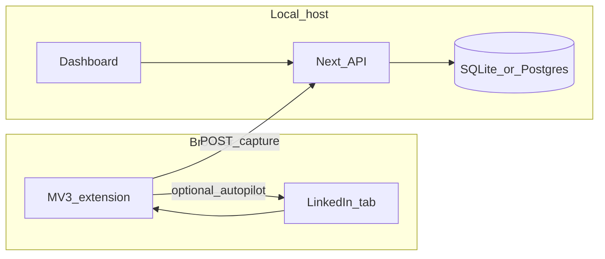

# Clin — local-first LinkedIn network intelligence

**Clin** (this repo) implements a personal relationship graph: capture, score, queue, review, and **optional autopilot on LinkedIn** when you turn it on.

This file is the **product and architecture vision**. For **current implementation detail** (routes, campaigns, readiness, ingest payloads), see [SPEC-0001](./specifications/SPEC-0001-clin-system-specification.md). For decision rationale, see [ADR index](./adr/README.md).

The Chrome MV3 extension lives in `extension/` (load unpacked for local dev).

---

## 1. Product boundaries

Clin supports **two modes** on LinkedIn; both write to the same local database.

| Mode | Behavior |
|------|----------|
| **Manual** | You open pages and trigger capture (popup / side panel). Same as classic “human-in-the-loop” workflows. |
| **Autopilot (LinkedIn)** | The extension may **auto-run** sequences you configure or start: programmatic navigation, scrolling to load lists, timed waits, opening tabs, and extracting **visible DOM** into the local API. **You choose** when autopilot is enabled, what jobs run, and global caps. |

**Still required (architecture):**

| Rule | Rationale |
|------|-----------|
| HTTP from extension → **local API** → DB | Server owns validation, canonical URLs, dedupe, snapshots. Extension does **not** open SQLite/Postgres directly. |
| **No cloud middleware** for capture payloads by default | Data stays on your machine unless you add something else. |
| **Auditable trail** | Captures are logged (`capture_sessions`, snapshots) so you can see what was read and when. |

**User responsibility (legal & account risk):**

- **LinkedIn’s terms, laws, and enforcement** apply to anything the browser does on their site. Autopilot **does not** make automation compliant or “safe” for your account. Use it only if **you** accept that risk.
- Clin should **not** ship features whose **primary purpose** is evading detection, rate limits, or platform integrity (e.g. fingerprint spoofing, credential sharing, coordinated inauthentic behavior). **Pacing and jitter** are allowed as **operational** knobs (load, courtesy, stability), not as a promise of stealth.
- **Outbound actions** (connection requests, messages, reactions) are **high risk**. Prefer read-only capture and navigation unless you explicitly scope and accept send/connect automation. Document any such feature as opt-in and dangerous.

**Posture:** Clin is a **personal power tool**. Defaults should lean **conservative** (caps, off-by-default autopilot, clear UI). Power users can raise limits or enable LinkedIn autopilot after reading warnings.

### 1.1 Pacing and caps (tunable in `/settings` and autopilot config)

Whether capture is manual or automated, **server and extension** should share enforceable limits:

- **Queue batch size** — dashboard: how many pending reviews to show before “load next batch”.
- **Seconds between profile opens** — dashboard `sessionStorage` for manual queue opens; autopilot should use the same or stricter server-informed gaps.
- **Seconds between captures** — server `429` if ingest is too soon; extension pre-checks via `GET /api/settings`.
- **Max captures per rolling hour** — server counts `capture_sessions`; extension mirrors in `chrome.storage.local` for fast feedback.
- **Autopilot-specific** — daily max steps, max open tabs, job timeout, and **global kill switch** (disable all LinkedIn automation in one toggle).

These limits **reduce accidental abuse and bursty traffic**; they **do not** guarantee LinkedIn will allow the behavior.

---

## 2. ICP and scope

- **Who:** Single user (founder); ~16k connections target scale.
- **Auth:** Defer multi-user auth; optional local bearer token + bind server to `127.0.0.1` in production-like local runs.
- **v1 deprioritized:** Multi-device sync, hosted SaaS, materialized dashboard views until slow.

**MVP success:** Weekly answers to *who to contact*, *who went cold*, *what changed* — with **explainable** scores and **auditable** captures — including optional **hands-off capture** when autopilot is enabled.

---

## 3. Repository layout

```
clin/
  docs/           # This specification
  web/            # Next.js app (dashboard + API routes)
  extension/      # Chrome MV3 (manual capture + optional LinkedIn autopilot runner)
```

**Default stack:** Next.js (App Router) in `web/` + **SQLite** (Drizzle + better-sqlite3) + MV3 extension. Postgres optional later.



**Pipeline:** `capture_sessions` → normalize URL → `contacts` + `contact_snapshots` → scoring (versioned rules) → `action_queue` / segments → (optional) **local LLM** analysis and autopilot job definitions.

---

## 4. Extension → backend (persistence rules)

- **“Direct to backend”** = HTTP to **your local Clin server** only (no cloud middleware) unless you configure otherwise.
- **Server owns the database:** validate, canonicalize `linkedin_url`, dedupe, write snapshots. Extension **never** holds DB credentials or writes the DB file.
- **If API is down:** buffer captures in `chrome.storage.local` (capped), retry when `GET /api/health` succeeds.

---

## 5. Chrome extension (MV3) design

**Role:** Client for **parse visible DOM → JSON → localhost** and, when enabled, **orchestrate LinkedIn autopilot** (tabs, navigation, scroll, timers) according to jobs from the local API and user settings.

**Recommended UI:** Side panel or popup + optional keyboard shortcut; status toasts for autopilot step / error / cap hit.

| Piece | Responsibility |
|-------|------------------|
| **Service worker** | Message hub; **`fetch` to `127.0.0.1`**; optional auth header; **alarms / orchestration** for autopilot steps when enabled |
| **Content script** | DOM access for extraction and, in autopilot mode, **scroll / visibility** helpers as implemented (must match manifest permissions) |
| **Popup / side panel** | Manual capture, autopilot start/stop, API health, dashboard link, cap and pacing display |

**Manifest hygiene:** `host_permissions` for `https://www.linkedin.com/*` (and variants) and `http://127.0.0.1:<PORT>/*`. Document every permission. **Fail closed** on parse errors; autopilot should **pause or stop** on repeated failures.

**Capture payload (conceptual):** `schemaVersion`, `pageType`, `sourceUrl`, `extractedFields`, `fieldPresence`, `confidence`, `capturedAt`.

**Autopilot payload (conceptual):** job id, step type (`open_url`, `scroll`, `wait`, `capture`, `ack`), bounds and backoff; server may return **next step** or **done** from `/api/automation/*` style endpoints (evolve as implemented).

**Build:** WXT or Plasmo recommended.

**DX:** Extension checks **`GET /api/health`**. Server rejects unknown `schemaVersion`.

---

## 6. Local API (minimal)

| Method | Path | Purpose |
|--------|------|---------|
| `GET` | `/api/health` | Liveness for extension |
| `GET` / `PATCH` | `/api/settings` | Read/update pacing (`pace.*` in `app_settings`) |
| `GET` | `/api/outreach/ready` | Rows with `outreach_decision = approved` (draft + URL) for handoff |
| `POST` | `/api/ingest/capture` | Extension / import ingest (429 when pacing exceeded) |
| `GET` | `/api/contacts` | Filters, keyset cursor, sort |
| `PATCH` | `/api/contacts/:id` | Tags, notes, queue state |
| `POST` | `/api/scores/recompute` | Versioned scoring job |
| *…* | `/api/automation/*`, `/api/autopilot/*` | Hygiene, batch analysis, future **autopilot job** APIs |

**Hardening:** prefer `127.0.0.1` binding for local-only; optional static bearer token; ingest throttling via pacing.

---

## 7. Data model (core entities)

- `contacts` — canonical URL, name, headline, company, location, segment, scores, `last_seen_at`, `last_updated_at`
- `capture_sessions` — timestamp, source page type, confidence
- `contact_snapshots` — history for diffs
- `tags`, `contact_tags`
- `interactions` (optional early)
- `scores` / audit — **rule version** + explainable reasons
- `recommendations`, `action_queue`, `notes`
- `app_settings` — key/value for pacing, autopilot flags, caps
- `action_queue.draft_outreach`, `action_queue.outreach_decision` — draft text and state (`pending` → `approved` → `sent`, or `skipped`)

**Dashboard:** overview charts; **Decisions** for drafts; **Autopilot** for automation status, caps, and batch LLM where applicable.

**Identity:** normalize LinkedIn URLs (strip tracking params, stable host/path).

---

## 8. Database performance (~16k rows)

- **Unique index:** `linkedin_url_canonical`
- **B-tree:** `segment`, `last_updated_at`, `company_normalized`
- **Search:** SQLite **FTS5** or Postgres `pg_trgm` / `tsvector`
- **Pagination:** keyset (cursor), avoid deep `OFFSET`

---

## 9. Scoring and AI

- **Scores:** relationship, opportunity, cleanup — each with **structured reasons**.
- **AI:** reads **stored** fields + notes for analysis; may also **propose** next autopilot targets (e.g. “refresh these profiles next”) as long as **execution** stays in the extension under user-configured rules.
- **LLM batch / after-capture** analysis runs **locally** against the DB (Ollama); see `/autopilot` and settings.

---

## 10. Actions (human-in-the-loop vs autopilot)

- **Manual:** open profile, copy draft, mark reviewed/defer/remove candidate, export CSV.
- **Autopilot:** may open URLs, scroll, and capture visible content per job configuration.
- **Sends / connects / reactions:** treat as **separate, explicit, high-risk** capabilities if implemented; default **off**; never ambiguous with “just capturing.”

---

## 11. Dashboard surfaces (reference)

Overview, Contacts, Queue, Autopilot, Insights, Capture log — see MVP iterations in issues/PRs as built.

---

## 12. Stack ladder

1. SQLite + one Node process (default).
2. Separate worker only if scoring/AI or heavy autopilot scheduling blocks the UI.
3. Tauri/Electron for one-click launch.
4. Postgres + Docker when analytics/ops warrant it.

---

## 13. Implementation note (autopilot vs this document)

This specification **authorizes** LinkedIn autopilot in product terms. **Concrete behavior** (which pages, which selectors, scroll depth, job API shape) must still be implemented in `extension/` and `web/` and kept in sync with LinkedIn’s live UI. When the DOM changes, autopilot steps may need updates; prefer **feature flags** and **dry-run / single-step** modes for development.
