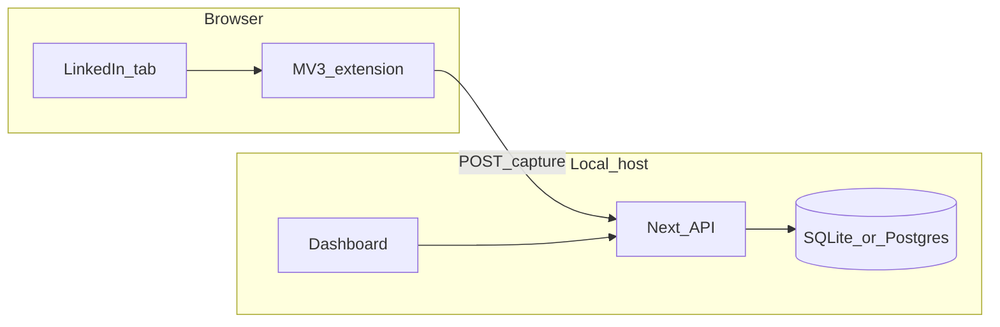

# Clin — local-first LinkedIn network intelligence

**Clin** (this repo) implements a personal relationship graph: capture, score, queue, review — **no scripted actions on LinkedIn**.

Canonical design for implementation lives in this file. The Chrome MV3 extension will ship separately under `extension/` when built.

---

## 1. Product boundaries (non-negotiable)

| Allowed | Not allowed (v1) |
|--------|-------------------|
| Capture **visible DOM** after **explicit user action** on a page you opened | Timers, auto-scroll, programmatic navigation on LinkedIn |
| HTTP `POST` from extension → **local API** → DB | Extension opens SQLite/Postgres directly |
| Drafts, queues, deep links, clipboard copy — **you** send on LinkedIn | Auto-click, mass connect/message, “humanized” bot timing |
| Randomness **inside Clin** (shuffle review queue, jitter local reminders) | Random delays / anti-detection patterns **on** LinkedIn |

**LinkedIn detection posture:** reduce risk by matching **normal personal use** (gesture-driven capture, human pace, least-privilege extension). **Not** by evasion tricks — those stay out of scope.

---

## 2. ICP and scope

- **Who:** Single user (founder); ~16k connections target scale.
- **Auth:** Defer multi-user auth; optional local bearer token + bind server to `127.0.0.1` in production-like local runs.
- **v1 deprioritized:** Multi-device sync, hosted SaaS, materialized dashboard views until slow.

**MVP success:** Weekly answers to *who to contact*, *who went cold*, *what changed* — with **explainable** scores and **auditable** captures.

---

## 3. Repository layout

```
clin/
  docs/           # This specification
  web/            # Next.js app (dashboard + API routes)
  extension/      # Chrome MV3 (optional scaffold later)
```

**Default stack:** Next.js (App Router) in `web/` + **SQLite** (Drizzle + better-sqlite3) + MV3 extension. Postgres optional later.



**Pipeline:** `capture_sessions` → normalize URL → `contacts` + `contact_snapshots` → scoring (versioned rules) → `action_queue` / segments.

---

## 4. Extension → backend (persistence rules)

- **“Direct to backend”** = HTTP to **your local Clin server** only (no cloud middleware).
- **Server owns the database:** validate, canonicalize `linkedin_url`, dedupe, write snapshots. Extension **never** holds DB credentials or writes the DB file.
- **v1.1 optional:** If API is down, buffer captures in `chrome.storage.local` (capped), retry when `GET /api/health` succeeds.

---

## 5. Chrome extension (MV3) design

**Role:** Thin client — `parse visible DOM → JSON → localhost → show result`. Heavy UI stays in `web/`.

**Recommended UI:** Side panel or popup + optional keyboard shortcut; optional minimal content-script toast for feedback.

| Piece | Responsibility |
|-------|----------------|
| **Service worker** | Message hub; **`fetch` to `127.0.0.1`**; optional auth header from `chrome.storage.local` |
| **Content script** | Run extraction **on demand** (`scripting.executeScript` after Capture) |
| **Popup / side panel** | Capture button, preview, API health, “open dashboard” |

**Manifest hygiene:** least privilege; `host_permissions`: `https://www.linkedin.com/*` and `http://127.0.0.1:<PORT>/*`. No background loops to LinkedIn. **Fail closed** on parse errors.

**Capture payload (conceptual):** `schemaVersion`, `pageType`, `sourceUrl`, `extractedFields`, `fieldPresence`, `confidence`, `capturedAt`.

**Build:** WXT or Plasmo recommended.

**DX:** Extension checks **`GET /api/health`**. Server rejects unknown `schemaVersion`.

---

## 6. Local API (minimal)

| Method | Path | Purpose |
|--------|------|---------|
| `GET` | `/api/health` | Liveness for extension |
| `POST` | `/api/ingest/capture` | Extension / import ingest |
| `GET` | `/api/contacts` | Filters, keyset cursor, sort |
| `PATCH` | `/api/contacts/:id` | Tags, notes, queue state |
| `POST` | `/api/scores/recompute` | Versioned scoring job |

**Hardening:** prefer `127.0.0.1` binding for local-only; optional static bearer token; light rate limit on ingest.

---

## 7. Data model (core entities)

- `contacts` — canonical URL, name, headline, company, location, segment, scores, `last_seen_at`, `last_updated_at`
- `capture_sessions` — timestamp, source page type, confidence
- `contact_snapshots` — history for diffs
- `tags`, `contact_tags`
- `interactions` (optional early)
- `scores` / audit — **rule version** + explainable reasons
- `recommendations`, `action_queue`, `notes`

**Identity:** normalize LinkedIn URLs (strip tracking params, stable host/path).

---

## 8. Database performance (~16k rows)

- **Unique index:** `linkedin_url_canonical`
- **B-tree:** `segment`, `last_updated_at`, `company_normalized`
- **Search:** SQLite **FTS5** or Postgres `pg_trgm` / `tsvector`
- **Pagination:** keyset (cursor), avoid deep `OFFSET`

---

## 9. Scoring and AI

- **Scores:** relationship, opportunity, cleanup — each with **structured reasons**.
- **AI:** reads **stored** fields + notes only; never drives live page automation.

---

## 10. Actions (human-in-the-loop)

Open profile, copy draft, mark reviewed/defer/remove candidate, export CSV. **No** automated sends/connects from the extension.

---

## 11. Dashboard surfaces (reference)

Overview, Contacts, Queue, Insights, Capture log — see MVP iterations in issues/PRs as built.

---

## 12. Stack ladder

1. SQLite + one Node process (default).
2. Separate worker only if scoring/AI blocks the UI.
3. Tauri/Electron for one-click launch.
4. Postgres + Docker when analytics/ops warrant it.
