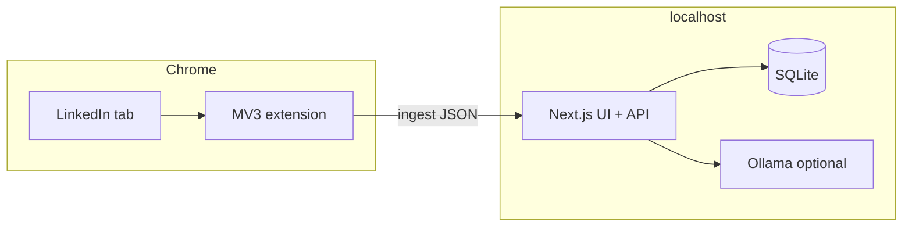

# SPEC-0001: Clin — system specification (as-built)

**Status:** current as of repository `main` / active development branch.  
**Scope:** `web/` (Next.js App Router + SQLite) and `extension/` (Chrome MV3).  
**Related:** [DESIGN.md](../DESIGN.md) (product vision and boundaries), [ADR index](../adr/README.md), [SPEC-0005](./SPEC-0005-unified-contact-analysis.md) (unified contact analysis — target), [ADR-0010](../adr/0010-unified-contact-analysis-playbook.md).

---

## 1. Purpose

Clin is a **local-first** tool to capture **visible** LinkedIn data you choose to open, store it in a **local database**, score and segment contacts, prepare **outreach drafts** (via optional **local Ollama**), and hand drafts back to you — **without** Clin sending messages or acting on LinkedIn on your behalf.

---

## 2. System context

| Actor | Role |
|--------|------|
| **User** | Opens LinkedIn in Chrome, triggers capture, edits campaigns and drafts in the dashboard. |
| **Chrome extension** | Reads visible DOM in the active tab, `POST`s JSON to the local API, polls campaign/outreach context. |
| **Clin web app** | Serves UI, REST API, persistence, validation, pacing, LLM calls to Ollama. |
| **SQLite** | Single-tenant store (`web/data/clin.db` by default). |
| **Ollama (optional)** | Local HTTP API for contact analysis and outreach draft generation. |

---

## 3. Repository layout

| Path | Contents |
|------|----------|
| `web/` | Next.js 14+ App Router, Drizzle ORM, API routes under `src/app/api/`. |
| `extension/` | Unpacked MV3: `background.js` (service worker), `popup.html` / `popup.js`. |
| `docs/` | DESIGN, specifications, ADRs. |

---

## 4. Core workflows

### 4.1 Capture (profile or list)

1. User opens a LinkedIn profile (`/in/…`) or a supported list (connections, people search).
2. User clicks **Capture** in the extension (or list sprint flow where enabled).
3. Extension runs page-world scrapers (via `chrome.scripting`), builds a JSON payload, `POST`s to `/api/ingest/capture` or `/api/ingest/connections-page`.
4. Server validates schema version, **canonicalizes** profile URLs, enforces **pacing** (minimum gap, rolling hourly cap), upserts `contacts`, inserts `capture_sessions` and `contact_snapshots`, recomputes scores.
5. If payload includes `outreachCampaignId` (from capture-target campaign context), server **attaches** imported contact IDs to that campaign.
6. Optional autopilot: after profile capture, **contact analysis** (`contact_analyze`) if Settings allow; if contact is a campaign member, **ICP check** and conditional draft (`runCampaignPostCaptureWorkflow`).

**Additional capture types (as-built):** `posts` (contact activity), `messaging` (DM thread). See section 6.1.

**Planned (SPEC-0005 / ADR-0010):** autopilot chain profile → posts → company → jobs; analysis deferred until `captureChainComplete`; unified **contact playbook** across Cleaning and Campaigns.

**Non-goals:** headless browsing, bulk DM send, stealth or fingerprint evasion (see DESIGN.md).

### 4.2 Outreach campaigns

- **Campaign** (`outreach_campaigns`): named context (`context_text`), optional `writer_instructions`, optional `system_prompt_override` for Ollama.
- **Member** (`outreach_campaign_members`): links `contact_id` to campaign; holds `draft_outreach`, `status`: `draft` → `ready` → `sent` | `skipped`, and optional **ICP check** fields (`icp_match`, `icp_rationale`, `icp_recommended_action`, `icp_checked_at`).
- **Capture target** (`app_settings` key `extension.capture_target_campaign_id`): extension polls `GET /api/extension/campaign-context`; ingests with this campaign id add new members to the campaign.
- **Active extension campaign** (`extension.active_outreach_campaign_id`): extension **Outreach** tab and related APIs use this campaign for ready-queue style handoff.

### 4.3 Profile readiness (campaign UI)

Readiness is derived (not a stored enum on the member row):

| Label | Meaning |
|--------|---------|
| **Profile: missing** | No `capture_sessions` row with `page_type = 'profile'` for this contact. |
| **Profile: thin** | Latest profile capture exists; stored `extracted_json` lacks “detailed” signals (see section 6.3) **or** capture exists but JSON is sparse (still counts as at least thin). |
| **Profile: detailed** | Latest profile JSON includes substantial About (≥ ~40 chars) and/or experience/education bullets. |

The dashboard exposes **filters** (e.g. need profile, thin, detailed, need draft, **review draft**, **ready for extension**, sent/skipped, ICP strong/partial/weak, awaiting reply) and a **capture queue summary** (counts + “open next profile” URL). The extension receives **`captureTargetQueue`** from `campaign-context` (counts + `nextProfileUrl`).

| Filter | Meaning |
|--------|---------|
| **review draft** | Open member with draft text, not yet marked `ready` |
| **ready for extension** | Member `status = ready` (approved for extension handoff) |

### 4.4 Draft generation (Ollama)

- **Per member:** server action / UI triggers `generateOutreachDraftForMember`; builds a user prompt from campaign fields, contact row, and **latest profile capture** `extracted_json` (About, experience/education bullets when present). Explicit note: **no LinkedIn DM history**.
- **Batch:** generates up to N members in `draft` status with **empty** draft; by default only contacts whose latest profile depth is **detailed** (`ok`); optional checkbox **allow weak profile** includes others.

### 4.5 Extension handoff (“ready” list)

- User marks campaign members **Ready for extension** in the UI.
- Extension loads ready items from campaign-scoped endpoints (e.g. `GET /api/extension/outreach-queue`, `GET /api/outreach/ready` where applicable).
- User copies draft, sends manually on LinkedIn, acknowledges in extension (e.g. mark sent).

### 4.6 Cleaning and contact analysis

- **Cleaning board** (`/cleaning`): buckets derived from contact LLM analysis (`contact_analyze`) — `cleaning_plan`, `outreach_fit`, stewardship — plus extraction readiness (profile/messaging depth).
- **Storage:** optional `llm_provisional_json` / `llm_refined_json` on contacts (via `contactSqlExtras`).
- **Side effect:** actionable buckets sync to `action_queue` (`cleaningQueue.ts`).
- **Campaign overlap:** campaign members use separate **ICP check** (`campaign_icp_check`); post-capture workflow runs ICP → draft, while autopilot may run `contact_analyze` independently. **Target:** unify via contact playbook ([SPEC-0005](./SPEC-0005-unified-contact-analysis.md)).

### 4.7 Legacy queue path

`action_queue` rows may still carry `draft_outreach` and `outreach_decision` (`pending` / `approved` / …) for the **Decisions** workflow. Campaign-based outreach is the **primary** model for multi-contact, context-aware drafts; both may coexist in the DB.

---

## 5. Data model (summary)

Key tables (see `web/src/db/schema.ts` for truth):

| Table | Role |
|--------|------|
| `contacts` | Canonical LinkedIn URL, name, headline, company, location, segment, scores, timestamps. |
| `capture_sessions` | `contact_id`, `page_type` (`profile` \| `posts` \| `messaging` \| `connections` \| …; **target:** `company`, `company_jobs`, `web_page`), `source_url`, `extracted_json`, `captured_at`, `confidence`. |
| `contact_snapshots` | Point-in-time JSON including scores after capture. |
| `outreach_campaigns` | Campaign metadata and LLM prompt fields. |
| `outreach_campaign_members` | Per-contact draft, status, and ICP check fields within a campaign. |
| `action_queue` | Review queue + optional draft/decision fields. |
| `app_settings` | Key/value: pacing, extension campaign ids, feature flags. |
| `user_context` | Self-profile link, goals, optional pending self-capture URL. |

**Identity:** `linkedin_url_canonical` is unique; slugs are **Unicode NFC-normalized** after `decodeURIComponent` to reduce duplicate contacts for the same profile.

---

## 6. Extension payloads

### 6.1 Single-page capture (`POST /api/ingest/capture`)

Validated by `capturePayloadSchema` (`web/src/lib/schemas.ts`):

- `schemaVersion` (e.g. `"1"`).
- `pageType`: `profile` \| `connections` \| `messaging` \| `posts` \| `unknown` (**target:** `company`, `company_jobs`, `web_page`).
- `sourceUrl`, optional `capturedAt`, `confidence`.
- `extractedFields` (profile): `fullName`, `headline`, `company`, `location`, `connectionDegree`; optional `about`, `experienceBullets`, `educationBullets`.
- `extractedFields` (posts): `targetProfileUrl`, `profilePosts[]` (`text`, `ageLabel`, `reactions`, `comments`, `postUrl`).
- `extractedFields` (messaging): `messagingParticipantProfileUrl`, `messagingMessages[]`, optional `messagingThreadId`.
- Optional `outreachCampaignId` (capture target).
- Optional `fieldPresence`.
- **Target (SPEC-0005):** optional `captureChainStep`, `captureChainComplete` for autopilot chains.

### 6.2 Connections / list page (`POST /api/ingest/connections-page`)

- `pageType: "connections"`, `listSourceUrl`, `rows[]` with `profileUrl` and visible fields.

### 6.3 Profile depth rules (server)

Implemented in `campaignMemberReadiness.ts` / `profileCaptureContext.ts`:

- **Detailed (`ok`):** About length ≥ ~40 **or** ≥1 experience bullet **or** ≥1 education bullet.
- **Thin:** any of headline, fullName, company, location, connection degree, short About, bullets; **or** any profile-type `capture_sessions` row exists (floor: not “missing” once a profile capture exists).
- **Missing:** no profile-type capture for that `contact_id`.

Connection degree text must not assume English-only labels (e.g. French “2e” is valid).

---

## 7. HTTP API catalog (non-exhaustive)

| Method | Path | Purpose |
|--------|------|---------|
| `GET` | `/api/health` | Liveness. |
| `GET` / `PATCH` | `/api/settings` | Pacing and related settings. |
| `POST` | `/api/ingest/capture` | Profile / unknown page ingest. |
| `POST` | `/api/ingest/connections-page` | List batch ingest. |
| `GET` | `/api/extension/campaign-context` | Capture target + active campaign + **captureTargetQueue** preview. |
| `POST` | `/api/extension/generate-outreach-draft` | Body `{ profileUrl }`: generate draft if contact is in capture-target or active extension campaign. |
| `GET` | `/api/extension/outreach-queue` | Ready items for extension. |
| `POST` | `/api/extension/outreach-queue/ack` | Acknowledge send/skip. |
| `GET` | `/api/outreach/ready` | Combined ready rows for UI/extension. |
| `GET` | `/api/contacts`, `PATCH` `/api/contacts/[id]` | Contacts CRUD-side updates. |
| `GET` | `/api/captures` | Capture log. |
| `GET` | `/api/queue`, `PATCH` `/api/queue/[id]` | Review queue. |
| `POST` | `/api/scores/recompute` | Recompute scores. |
| `GET` / `PATCH` | `/api/automation/settings` | Hygiene / automation toggles. |
| `GET` | `/api/automation/next`, `POST` `/api/automation/ack` | Hygiene runner steps. |

**Errors:** ingest returns **429** when pacing rejects a capture; extension mirrors limits using `GET /api/settings`.

---

## 8. Security and deployment assumptions

- Bind to **127.0.0.1** in production-like local use; optional bearer token if exposed.
- No default cloud sync; data stays on disk unless the operator adds backup/sync.
- LLM calls go to **user-configured** Ollama base URL (local).

---

## 9. Change process

- **Schema:** edit `web/src/db/schema.ts`, generate migration (`npm run db:generate`), apply per project practice.
- **Ingest contract:** bump `schemaVersion` only when breaking; extend Zod schemas for additive fields.
- **Selectors:** LinkedIn DOM changes require updates in `extension/background.js`; document in commit messages and, if structural, add an ADR.

---

## 10. Glossary

| Term | Definition |
|------|------------|
| **Capture target** | Campaign that receives new members from extension ingests that include its id. |
| **Canonical URL** | Normalized `https://www.linkedin.com/in/{slug}` (NFC slug, decoded). |
| **Profile capture** | `capture_sessions` row with `page_type = 'profile'`. |
| **Thin / detailed** | Derived quality of last profile JSON for outreach prep. |
| **Contact playbook** | Target unified recommendation (clean, nurture, message, etc.) shared by Cleaning and Campaigns; see SPEC-0005. |
| **Contact context bundle** | Target L1 read-model: profile + posts + company intel for all contact LLM features. |
| **Capture chain** | Target ordered autopilot captures (profile → posts → company → jobs) before analysis runs. |
