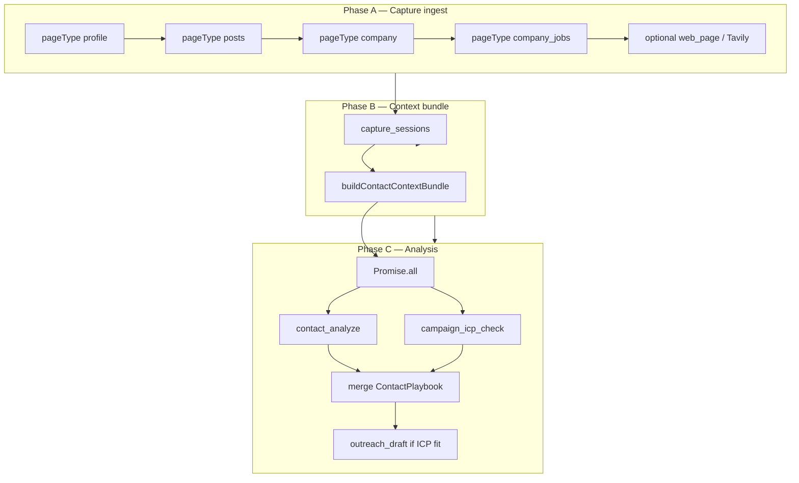

# SPEC-0005: Unified contact analysis (capture chain, context bundle, playbook)

**Status:** Target — ADR-0010 accepted; implementation phased (see rollout section).  
**Scope:** `web/` server, `extension/` autopilot, Cleaning + Campaigns UI.  
**Related:** [ADR-0010](../adr/0010-unified-contact-analysis-playbook.md), [SPEC-0001](./SPEC-0001-clin-system-specification.md), [ADR-0005](../adr/0005-unified-llm-inference-layer.md), [ADR-0008](../adr/0008-editorial-autopilot-jobs-sources.md).

---

## 1. Purpose

Provide **one strategic/tactical recommendation** per contact (clean, nurture, comment, message, enrich, etc.) shared across **Cleaning** and **Campaigns**, grounded in:

- Profile capture (About, experience, education)
- LinkedIn posts (contact activity)
- Company intel (LinkedIn company page, jobs tab, optional web careers page / Tavily)

Analysis runs **after** the capture chain stores raw intel—not during individual ingests.

---

## 2. Pipeline



### 2.1 When analysis runs

| Trigger | `captureChainComplete` | Analysis |
|---------|------------------------|----------|
| Autopilot enrich (full chain) | `true` on last step only | Full bundle → Phase C |
| Autopilot enrich (posts/company off) | `true` on profile step | Phase C with partial bundle |
| Manual single capture | `true` (default) | Phase C immediately |
| Intermediate chain step | `false` | Ingest only; `{ analysisDeferred: true }` |

Re-analysis: user **Re-analyze** button, or new capture with `captureChainComplete: true`, rebuilds bundle from latest sessions.

---

## 3. Data model

### 3.1 `contacts` (extended)

| Column | Type | Notes |
|--------|------|-------|
| `company_linkedin_url` | text, nullable | Canonical `/company/…` from profile Voyager; set on profile ingest |

Existing LLM columns (`llm_provisional_json`, `llm_refined_json` via `contactSqlExtras`) gain embedded **`playbook`** object (see §5).

### 3.2 `capture_sessions.page_type` (extended)

| `page_type` | `extracted_json` (summary) | Status |
|-------------|---------------------------|--------|
| `profile` | Existing fields | As-built |
| `posts` | `targetProfileUrl`, `profilePosts[]` | As-built |
| `messaging` | Thread messages | As-built |
| `company` | `companyLinkedInUrl`, `name`, `about`, `industry`, `sizeLabel`, `websiteUrl`, `hq` | **Target** |
| `company_jobs` | `companyLinkedInUrl`, `jobs[]` (`title`, `location`, `ageLabel`, `jobUrl`) | **Target** |
| `web_page` | `sourceUrl`, `title`, `excerpt`, `fetchedAt` | **Target** |

### 3.3 `outreach_campaign_members` (unchanged columns, clarified role)

| Column | Role under ADR-0010 |
|--------|---------------------|
| `icp_match`, `icp_rationale`, `icp_recommended_action`, `icp_checked_at` | Campaign-scoped fit for **filters** and **auto-draft** gate |
| `draft_outreach`, `status` | Outreach handoff unchanged |

Playbook on the contact is the **unified human advice**; member ICP is an **overlay** and automation input.

### 3.4 `app_settings` (new keys, proposed)

| Key | Purpose |
|-----|---------|
| `autopilot.capture_posts_after_profile` | Chain posts capture after profile |
| `autopilot.capture_company_after_profile` | Chain company + jobs capture |
| `autopilot.contact_intel_tavily_enabled` | Optional Tavily for careers discovery |
| `autopilot.contact_intel_tavily_daily_budget` | Max Tavily credits per day for contact intel |

---

## 4. ContactContextBundle

**Module:** `web/src/lib/contactContextBundle.ts`

```ts
type ContextDepth = "missing" | "thin" | "ok";

type ContactContextBundle = {
  contactId: string;
  profile_context: string;       // narrative block, capped
  company_intel_context: string; // narrative block, capped
  context_completeness: {
    profile: ContextDepth;
    posts: ContextDepth;
    company: ContextDepth;
    web: ContextDepth;
  };
  capturedAt: {
    profile: string | null;
    posts: string | null;
    company: string | null;
    company_jobs: string | null;
    web_page: string | null;
  };
};
```

**Builders:**

- `profile_context` — `getLatestProfileContextForOutreach` (`profileCaptureContext.ts`).
- `company_intel_context` — `getLatestCompanyIntelForContact` (new; merges latest `company`, `company_jobs`, `web_page` sessions).

**Depth rules (posts):**

| Depth | Rule |
|-------|------|
| `missing` | No `page_type = posts` session |
| `thin` | Posts session with &lt; 2 posts with text |
| `ok` | ≥ 2 posts with substantive text |

**Depth rules (company):** `missing` = no company session; `thin` = company without jobs; `ok` = company + jobs session or substantive web_page excerpt.

---

## 5. ContactPlaybook

**Module:** `web/src/lib/contactPlaybook.ts`

### 5.1 Canonical actions

| `ContactNextAction` | User meaning |
|---------------------|--------------|
| `enrich_first` | Capture more before deciding |
| `needs_review` | Enough data; judgment unclear |
| `review_remove` | Prune connection |
| `engage_comment` | Light touch via post comment |
| `nurture` | Keep warm; no pitch now |
| `message` | DM / campaign outreach |
| `hold` | No urgent action |

### 5.2 Playbook object

```ts
type ContactPlaybook = {
  action: ContactNextAction;
  confidence: "low" | "medium" | "high";
  rationale: string;
  playbook: string;              // one imperative next step
  motion?: SalesMotion;          // from salesCoachPlaybook.ts
  sources: ("contact_analyze" | "campaign_icp" | "posts_signals" | "company_intel")[];
  analyzedAt: string;            // ISO
  strategic_summary?: string;
  posts_signals?: {
    topics?: string[];
    hiring_or_role_change?: boolean;
    engagement_hook?: string;
    suggested_comment_angle?: string;
  };
  company_intel_summary?: string;
  campaign_overlay?: {
    campaignId: string;
    icp_match: "strong" | "partial" | "weak" | "unknown";
    recommended_action: "keep_and_draft" | "keep" | "review_remove" | "skip";
  };
};
```

### 5.3 Merge rules

1. **Base** from latest `contact_analyze` (`cleaning_plan.bucket` → `ContactNextAction` map).
2. **Campaign overlay** when member exists: `strong` + `keep_and_draft` biases toward `message`; `weak` / `review_remove` toward `review_remove` or `hold`; `partial` + `keep` toward `nurture` or `engage_comment`.
3. On conflict, campaign overlay adjusts `action` but preserves contact `rationale` unless ICP rationale is newer and higher confidence.

### 5.4 Mapping from legacy cleaning buckets

| Cleaning bucket | Default `ContactNextAction` |
|-----------------|----------------------------|
| `enrich_first` | `enrich_first` |
| `needs_review` | `needs_review` |
| `review_remove` | `review_remove` |
| `reach_out_dm` | `message` |
| `engage_comment` | `engage_comment` |
| `nurture_light` | `nurture` |
| `keep_passive` | `hold` |

---

## 6. LLM features

All use ADR-0005 `completeChat`.

| Feature tag | When | Input | Output |
|-------------|------|-------|--------|
| `contact_analyze` | Phase C; manual analyze | `ContactContextBundle` + owner context + motion playbook | Extended JSON → playbook base |
| `campaign_icp_check` | Phase C; manual Check ICP | Bundle + campaign ICP text | Member `icp_*` + playbook overlay |
| `contact_intel_summarize` | Optional pre-pass when company intel &gt; token budget | Raw company/jobs JSON | Short bullet summary for bundle |
| `outreach_draft` | After ICP fit | Bundle + campaign writer instructions | Member `draft_outreach` |

### 6.1 contact_analyze prompt structure

**System:** strategic then tactical layers; motion playbook block; JSON-only response; grounding rules (payload facts only; note missing sections in `data_gaps`).

**User:** labeled JSON:

- `PROFILE`
- `POSTS` (within profile_context or separate)
- `COMPANY_INTEL`
- `OWNER_CONTEXT`
- `analysis_tier_requested` (`provisional` | `refined`)

**Optional JSON fields:** `reasoning_steps[]` (internal, UI collapsed), `strategic_assessment`, `tactical_action`, `posts_signals`.

### 6.2 Analysis tier

Existing `inferAnalysisTier` rules apply: thin profile → `provisional`; full bundle with `profile: ok` → `refined`.

---

## 7. Extension autopilot chain

**Settings-gated steps** after successful profile capture (`enrichOneProfileStep`, campaign queue capture):

1. **Posts** — navigate to activity / recent posts; `scrapePostsFromTab`; ingest `pageType: posts`.
2. **Company** — open `contacts.company_linkedin_url`; ingest `pageType: company`.
3. **Jobs** — open company jobs tab; scroll; ingest `pageType: company_jobs`.
4. **Web (server-side)** — triggered only on `captureChainComplete` if policy enabled: fetch careers URL or Tavily; ingest `pageType: web_page`.

Each step respects pacing (`429`, hourly cap). Last step sets `captureChainComplete: true`.

### 7.1 Ingest payload extensions

Additive fields on `capturePayloadSchema`:

| Field | Type | Notes |
|-------|------|-------|
| `captureChainStep` | enum optional | `profile` \| `posts` \| `company` \| `company_jobs` |
| `captureChainComplete` | boolean optional | Default `true` when omitted (manual capture) |

---

## 8. HTTP API

### 8.1 Modified

| Method | Path | Change |
|--------|------|--------|
| `POST` | `/api/ingest/capture` | Accept new page types and chain fields; call `postCaptureAnalysis` when `captureChainComplete` |

### 8.2 Unchanged entry points (consume bundle internally)

| Method | Path |
|--------|------|
| `POST` | `/api/contacts/[id]/analyze` |
| `POST` | `/api/campaigns/[id]/members/[memberId]/icp-check` |

---

## 9. UI

| Surface | Change |
|---------|--------|
| `/cleaning` | Cards show `ContactPlaybook` via shared `RecommendationPanel` |
| `/campaigns/[id]` (exec tab) | Playbook block + ICP badge; filters unchanged |
| `/contacts/[id]` | `ContactLlmPanel` shows strategic/tactical layers and intel completeness |
| `/settings` | Toggles for capture chain and Tavily contact intel budget |

Member readiness filters (as-built): `review_draft` = open members with draft text not yet `ready`; `extension_ready` = `status = ready`.

---

## 10. External intel sources (priority)

| Priority | Source | Mechanism | Cost |
|----------|--------|-----------|------|
| 1 | LinkedIn company page | Extension capture → `company` | Free (user-operated) |
| 2 | LinkedIn company jobs | Extension capture → `company_jobs` | Free |
| 3 | Careers page URL | Readability fetch from `websiteUrl` → `web_page` | Free |
| 4 | Tavily | `contact_intel` queries; reuse `sources/adapters/tavily.ts` | Credit-budgeted |
| 5 | Company RSS / public job APIs | Future; `SourceFetcher` pattern | Free tiers |

**Out of scope:** headless LinkedIn scraping, paid enrichment APIs, automated outbound actions from playbook.

---

## 11. Rollout phases

| Phase | Deliverable |
|-------|-------------|
| 1 | Autopilot posts chain + settings |
| 2 | `ContactContextBundle`; enrich `contact_analyze` with bundle + posts_signals |
| 3 | `ContactPlaybook` + `RecommendationPanel`; Cleaning + Campaign UI |
| 4 | `postCaptureAnalysis` orchestrator + `captureChainComplete` contract |
| 5a | `company_linkedin_url`, `company` / `company_jobs` capture types + chain |
| 5b | `web_page` ingest, optional Tavily `contact_intel` |

---

## 12. Glossary

| Term | Definition |
|------|------------|
| **Capture chain** | Ordered autopilot captures for one contact before analysis |
| **ContactContextBundle** | L1 read-model assembling all prompt context for a contact |
| **ContactPlaybook** | L3 unified recommendation stored on contact LLM envelope |
| **Company intel** | Company page + jobs + optional web excerpt, consumed in Phase B/C |
| **Analysis deferred** | Ingest succeeded; Phase C skipped until chain completes |
